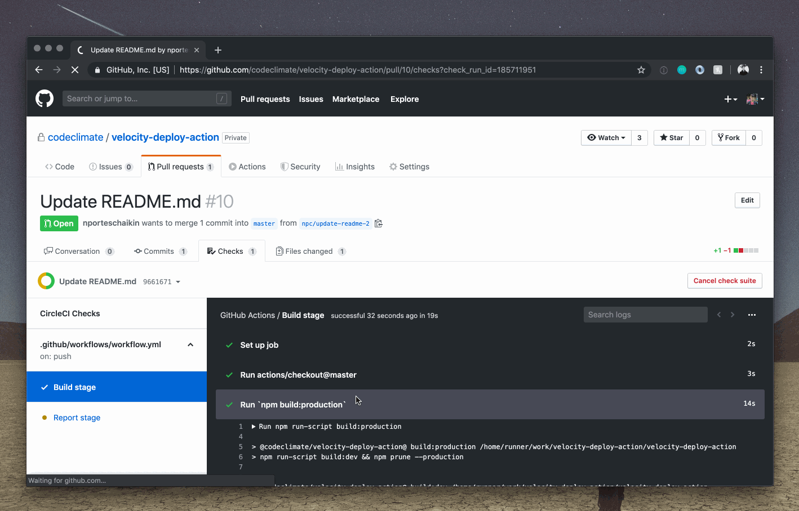

# Velocity deployment reporter

This is a simple GitHub action that will report deployments to [Velocity](https://codeclimate.com/velocity)

### Usage

In your workflow, define a step which refers to the action:

```yml
    steps:
      # ...
      - name: Send Velocity deployment
        uses: codeclimate/velocity-deploy-action@master
        with:
          token: ${{ secrets.VELOCITY_DEPLOYMENT_TOKEN }}
          version: ${{ outputs.version }}
          environment: ${{ outputs.environment }}
```

There are two possible inputs:

- `token`: (string, required): The Velocity deployment token, which you can find on Velocity's settings. This should be provided as a secret, which you can add by visiting the GitHub repository's settings page.
- `version`: (string) The version tag for the deploy (i.e. `b123`). If this action is triggered on a `deploy` event, it will also try to infer the environment from the event. Please note that the version must be unique for each deployment for the same repository and environment. In other words, if you already deployed a v1.0 for https://github.com/user/project in production, the next deploy for the same repository and environment must have a different version, or no version.
- `environment`: (string) The environment of the deploy (i.e. `production`).

### Demo


### Copyright

See [LICENSE](LICENSE)
